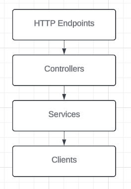

# Weather App

## Overview

This project is a simple backend service built with ZIO that fetches weather forecasts from the weather.gov API.

## Getting Started

### Running the Server (using Docker)

Build `docker build -t weather-app:latest .`
Run `docker run --rm -p 4041:4041 weather-app:latest`

### Calling the Service (examples)

#### Happy path

`curl -v localhost:4041/forecast/39.44,-105.868`

#### Malformed Input

`curl -v localhost:4041/forecast/39.44a,-105.868`

#### Out of range of coverage (for weather.gov)

`curl -v localhost:4041/forecast/39.44,-175.868`

## Architecture

The code follows a layered architecture:

1. _HTTP Endpoints_: this layer handles incoming HTTP requests directly. It is responsible for directing the request to the appropriate controller.
2. _Controllers_: this layer takes input from the HTTP endpoints and coordinates the application's response by interacting with the appropriate services. They handle the flow of data to and from the services, and decide what final response to send back to the HTTP layer. Take a look at `HttpError.scala` to see how it handles exceptions and which correct status to return. If further validation was necessary, it would happen here (API key verification, login session check, etc.)
3. _Services_: this layer contains the core business logic. It coordinates high-level operations involving data from one or more data sources or other business services. This layer orchestrates calls to client services and aggregate their data to perform a specific business function. Here, it simply validates the input is formed correctly and passes it along to the weather.gov client.
4. _Clients_: this layer interacts directly with external services (clients). Here client logic (weather.gov) is isolated and only returns a response that satisfies the service's requirements.

## Improvements

1. A wider range of tests, specifically for the generic client that has parsing logic. In order to preserve time, I decided to keep tests simple.
